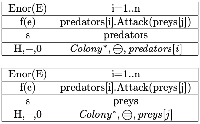

# Object-oriented programming course taken in Eötvös loránd university in spring semester 2023

## Laboratory 1

The code can be found [here](/Laboratory1/Set/)
The lab assignment paper can be found [here](/Laboratory1/LaboratoryPaper.pdf)

Implement the set type which contains integers. Represent the set as a sequence of its elements. Implement as methods: inserting an element, removing an element, returning whether the set is empty, returning whether the set contains an element, returning a random element without removing it from the set, returning the number of even numbers in the set (suggestion: store the number of even numbers and update it when the set changes), printing the set. A set can store every element only once.

Every function required to have mathematical definition of the functions, specification, analogy, structugrams.
### Mathematical definition of the set

$Set(n) = \{a\in \mathbb{Z} \ | \  \forall i,j \in [1..n] : i \neq j \rightarrow a[i] \ne a[j]\}$
### Specification of insert element to set
$A=(s:Set, e:\mathbb{Z})$

$Pre=(s=s^{\prime})$

$Post=( Pre  = s = s ^\prime\cup\{e\})$

$s=\text{output values}, s^\prime=\text{input values}$

### Remove element from set structugram

## Laboratory 2

The code can be found [here](/Laboratory2/Simulation/)
The lab assignment paper can be found [here](/Laboratory2/LaboratoryPaper.pdf)

Simulate the process until each of the prey colonies becomes extinct or the number of prey animals quadruples compared to its starting value. Print the data of each colony in each turn.
We are simulating the animals of the tundra. There are colonies of prey and predator animals. The number of animals in a colony affect the number of animals in other colonies. There are three predator species: the snowy owl, the arctic fox and the wolf. There are three kinds of prey: the lemming, the arctic hare and the gopher.
If the number of prey animals increase, predators can reproduce more quickly. If the number of prey is very large, most of them will wander away because they cannot find enough food. If the number of predators is large, the number of the prey decreases quicker as they are preyed upon.
Each colony has a name, a species, and the number of animals in the colony. The prey species are affected by the different predator species as follows. The number of animals in their own colony changes first, then they influence the predators.
Lemming: If they are preyed upon by a predator colony, the number of animals in their colony decreases by four times the number of animals in the predator colony. The number of animals in their colony doubles every second turn. If there are more than 200 animals in the colony, the number of animals in the colony decreases to 30.
Hare: If they are preyed upon by a predator colony, the number of animals in their colony decreases by double the number of animals in the predator colony. The number of animals in their colony grows by 50 percent (to one and a half times their previous number) every second turn. If there are more than 100 animals in the colony, the number of animals in the colony decreases to 20.
Gopher: If they are preyed upon by a predator colony, the number of animals in their colony decreases by double the number of animals in the predator colony. The number of animals in their colony doubles every fourth turn. If there are more than 200 animals in the colony, the number of animals in the colony decreases to 40.
Predators choose and attack a prey colony randomly in each turn. If there are not enough animals in the attacked colony (for example, there are not four times the number of predators in a lemming colony), the number of predators also decreases: every fourth predator out of the ones who didn’t get prey perishes. Predators have offsprings every eighth turn. Normally, the snow owls have 1 offspring per 4 animals, the foxes have 3 offsprings per 4 animals, and the wolves have 2 offsprings per 4 animals.
The program should read the colonies from a text file. The first line contains the number of prey and predator colonies separated by a space. Each of the next lines contains the data of one colony separated by space: their name, their species, their starting number of animals. The species can be: o - owl, f - fox, w - wolf, l - lemming, h - hare, g - gopher.

Every function required to have mathematical definition of the functions, specification, analogy, structugrams and a class diagram.

### Specification of one iteration simulation

$A=(preys:Colony', predators:Colony', year:int)$

$Pre=(preys=preys' \land predators = predators' \land year>0)$

$Post = (\forall i\in[1..|preys|] : preys[i].Reproduce(year)\land \forall i\in[1..|predators|]:predators[i].Reproduce(year)$

$\land \forall i \in [1..|predators|]: preys[i],predators[i] = predators[i].Attack(prey[random()]))$
### Laboratory work 2 analogy

### Laboratory work 2 structugram

### Class diagram of laboratory work 2

## Week2, 3, 4
Tasks which were programmed during the OOP practice lectures.
